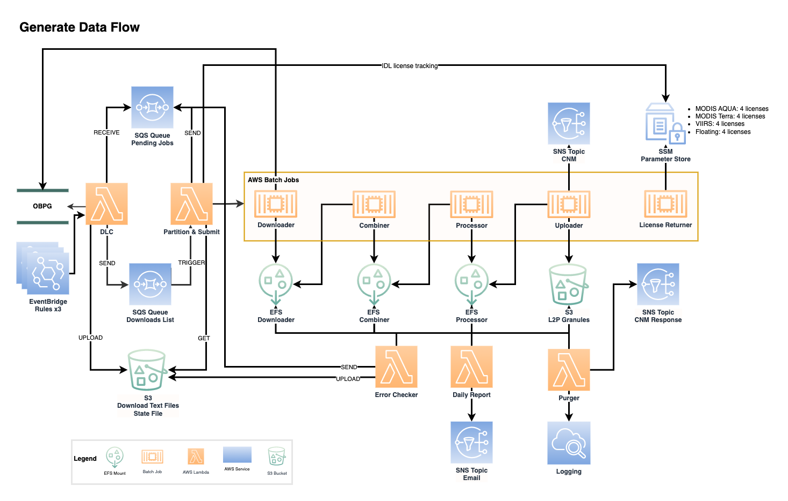

# generate

Generate is a program that downloads data from the Ocean Biology Processing Group (OBPG). Generate processes the data is downloads to create three Level 2P datasets.

Generate downloads the following data:
- MODIS Aqua: https://oceancolor.gsfc.nasa.gov/about/missions/aqua/
- MODIS Terra: https://oceancolor.gsfc.nasa.gov/about/missions/terra/
- VIIRS: https://oceancolor.gsfc.nasa.gov/about/missions/snpp/
- JPSS1: https://oceancolor.gsfc.nasa.gov/about/missions/noaa20/

The API for searching and downloading data can be found here: https://oceancolor.gsfc.nasa.gov/data/download_methods/#api

Generate outputs the following data:
- MODIS_A-JPL-L2P-v2019.0: https://podaac.jpl.nasa.gov/dataset/MODIS_A-JPL-L2P-v2019.0
- MODIS_T-JPL-L2P-v2019.0: https://podaac.jpl.nasa.gov/dataset/MODIS_T-JPL-L2P-v2019.0
- VIIRS_NPP-JPL-L2P-v2016.2: https://podaac.jpl.nasa.gov/dataset/VIIRS_NPP-JPL-L2P-v2016.2
- VIIRS_JPSS1-JPL-L2P-v2024.0: https://podaac.jpl.nasa.gov/dataset/VIIRS_JPSS1-JPL-L2P-v2024.0

## components

Generate consists of several components:
- download list creator: Creates list of files to download (search and download from OBPG).
- partition and submit: Partitions downloads into jobs and submits the Generate workflow as AWS Batch jobs.
- downloader: Downloads files from lists created by the download list creator.
- combiner: Combines downloaded files into a single NetCDF file.
- processor: Processes combined files into final L2P granule NetCDF file.
- uploader: Uploads final L2P granules to an S3 bucket and kick offs archive ingestion.
- cnm_responder: Processes CNM messages (responses) published to a SNS Topic.
- token_creator: Periodically creates or renews the EDL bearer token required to preform CMR queries.
- license returner: Returns IDL licenses that were used in the current execution of the Generate workflow.
- error_handler: Handles AWS Batch job failures by logging and notification.
- error_checker: Checks for any files that have been quarantined and restarts the Generate worfklow for those files.
- reporter: Generates daily reports on the number of L2P granules that were processed for MODIS Aqua, MODIS Terra, and VIIRS.
- purger: Deletes files from the EFS mount archive, downloader, combiner, and processor components that are older than a specific threshold.

Component repo links:
- download list creator: https://github.com/podaac/generate_download_list_creator
- parition and submit: https://github.com/podaac/generate_partition_submit
- downloader: https://github.com/podaac/generate_downloader
- combiner: https://github.com/podaac/generate_combiner
- processor: https://github.com/podaac/generate_processor
- uploader: https://github.com/podaac/generate_uploader
- cnm_responder: https://github.com/podaac/generate_cnm_responder
- token_creator: https://github.com/podaac/generate-token-creator
- license returner: https://github.com/podaac/generate_license_returner
- error_handler: https://github.com/podaac/generate_error_handler
- error_checker: https://github.com/podaac/generate_error_checker
- reporter: https://github.com/podaac/generate_reporter
- purger: https://github.com/podaac/generate_purger

## aws infrastructure

The Generate workflow includes the following AWS services:
- AWS Batch compute environment with launch template and user-data script, job queue, and scheduling policy for each dataset.
- Elastic file system for the following components: downloader, combiner, processor.
- IAM roles and policies for Batch and ECS permissions.
- S3 bucket to hold final L2P output.
- Security groups to support EFS network traffic in VPC.

## terraform 

Deploys AWS infrastructure and stores state in an S3 backend using a DynamoDB table for locking. The top-level `terraform` directory contains AWS infrastructure that applies to all components. Each component may have additional terraform files for deploying AWS resources, see each components `README.md` for details.

To deploy:
1. Edit `terraform.tfvars` for environment to deploy to.
2. Edit `terraform_conf/backed-{prefix}.conf` for environment deploy.
3. Initialize terraform: `terraform init -backend-config=terraform_conf/backend-{prefix}.conf`
4. Plan terraform modifications: `terraform plan -out=tfplan`
5. Apply terraform modifications: `terraform apply tfplan`

`{prefix}` is the account or environment name.